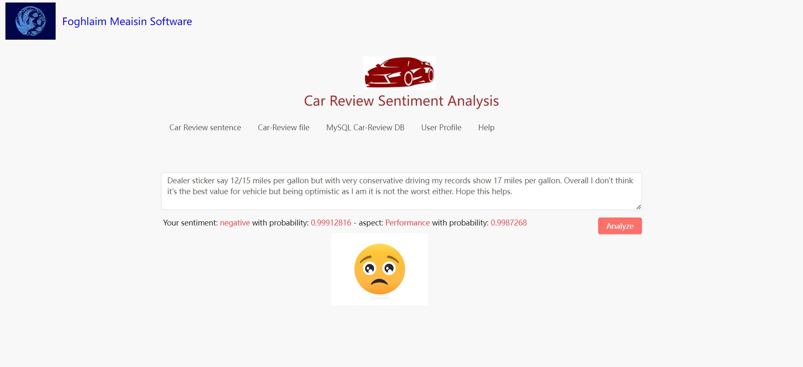
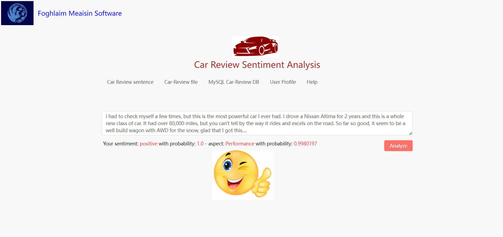
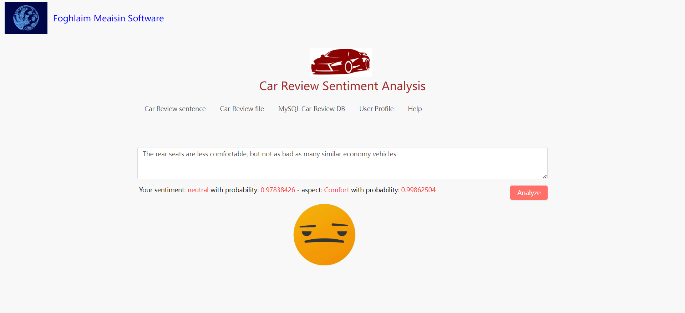
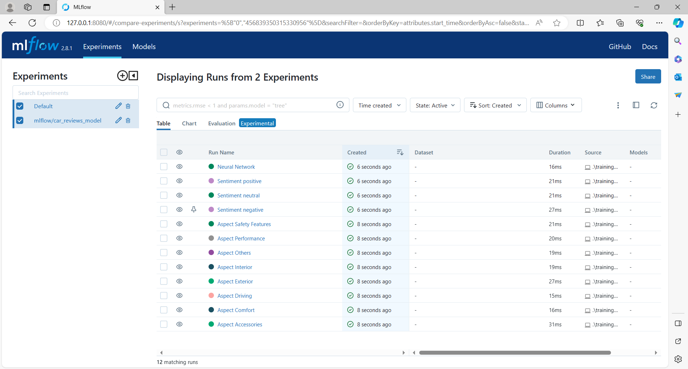
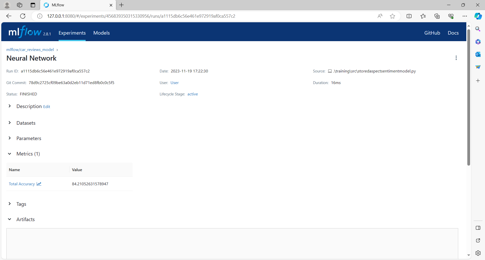
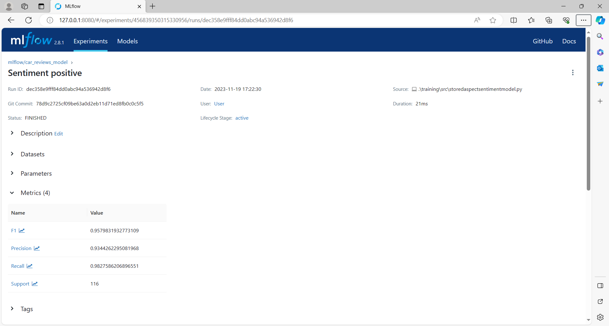

<h1>Sentiment Analysis on Car Reviews</h1>

We are Foghlaim Meaisin Software, an IT organization (company) established in Calgary, Alberta, Canada.
 
We have new research on Machine Learning for Sentiment Analysis on Car Reviews for Vehicle Dealers, called the "FM Carsen" software.
 
<h2>These are our software demonstration using React frontend</h2>
 
I) Negative Sentiment Detection
 

 
II) Positive Sentiment Detection

 
III) Neutral Sentiment Detection

IV) MLflow on Databricks

a) Project history

b) Sentiment analysis history

c) Positive prediction accuracy

d) Aspect prediction accuracy

 
This software is very useful for Car Dealers who like to have a Python Flask Backend and a React Frontend demonstration.

COPYRIGHT@2019 OF FOGHLAIM MEAISIN SOFTWARE, CALGARY, ALBERTA, CANADA.
